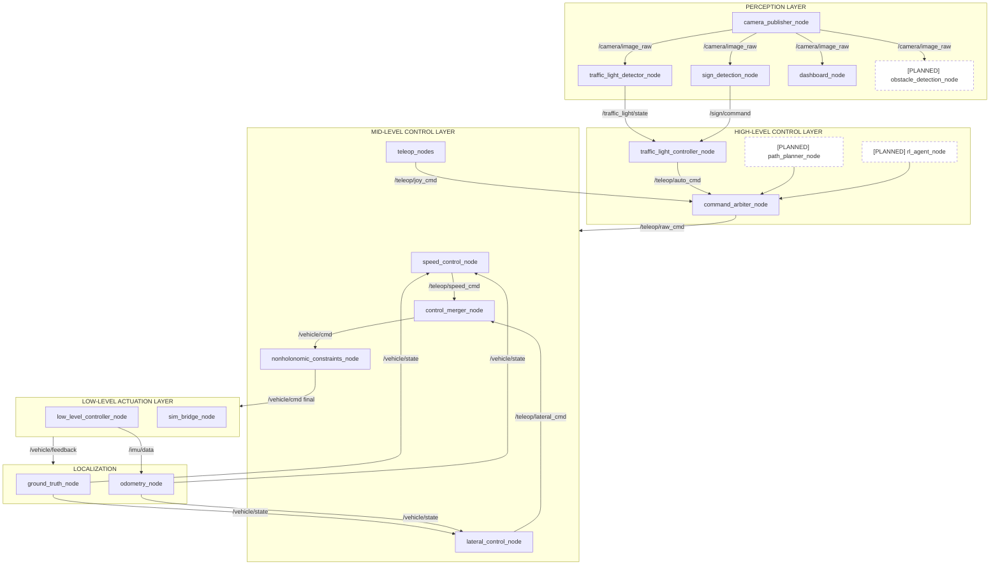
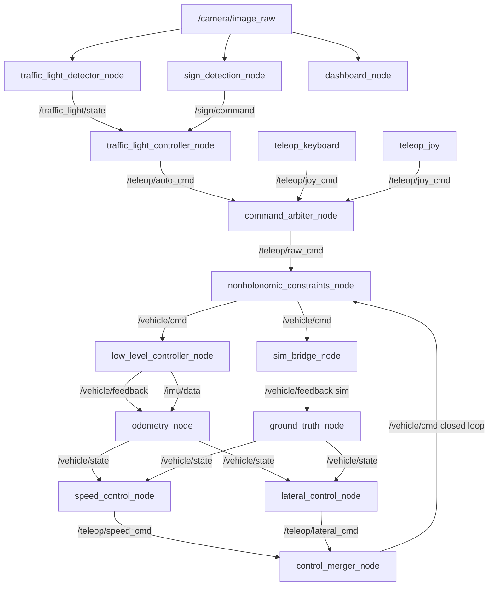

# Zooba — Autonomous 1:10 Scale Vehicle

<p align="center">
  <em>A modular ROS 2 autonomous driving stack for a 1:10 scale car — from perception to actuation.</em>
</p>

---

## Table of Contents

- [Brief Description](#brief-description)
- [System Architecture](#system-architecture)
- [Hardware and Setup](#hardware-and-setup)
- [Software Setup and Prerequisites](#software-setup-and-prerequisites)
- [How to Use](#how-to-use)

---

## Brief Description

The ultimate goal of Zooba is to build a **fully autonomous 1:10 scale vehicle** that behaves as an intelligent agent — capable of perceiving its environment, planning optimal paths, and making real-time decisions such as:

- 🚦 **Obeying traffic signals** — stopping at red lights, slowing at yellow
- 🛑 **Responding to traffic signs** — stop signs, slow down, directional signs
- 🚗 **Dynamic lane changes** — changing lanes when a vehicle is detected in front
- 🗺️ **Path planning** — computing and following optimal trajectories through waypoints
- 🧠 **Learned behaviour (RL)** — a reinforcement learning agent that makes high-level driving decisions based on the fused perception state

The project is modular by design: each subsystem (perception, planning, control, actuation) is a separate ROS 2 package that communicates through well-defined interfaces, making it easy to swap, upgrade, or extend any layer independently.

---

## System Architecture

The architecture follows a **four-tier layered design**: Perception → High-Level Control → Mid-Level Control → Low-Level Actuation, with a parallel Localization module providing state estimation and feedback to all control layers.



### Topic & Data Flow



---

## Hardware and Setup

### Components

| Component | Model | Role |
|:----------|:------|:-----|
| **Compute** | Raspberry Pi 4B | Main ROS 2 brain |
| **Microcontroller** | Arduino Uno | Low-level actuator control |
| **Camera** | USB Webcam (V4L2) | Visual perception |
| **IMU** | HW-123 (MPU6050) | Heading estimation |
| **Drive Motor** | 12V JGA-370 DC Motor (with encoder) | Propulsion |
| **Motor Driver** | L298N H-Bridge | Motor power switching |
| **Steering** | MG995 Servo Motor | Front wheel steering |
| **Power** | 12V 5A DC Power Supply | System power |
| **Voltage Regulator** | LM2596 Buck Converter | 12V → 6V for servo |

### Wiring Notes

- The 12V supply powers the L298N motor driver.
- **⚠️ CRITICAL:** The MG995 servo runs strictly on **6V**. Use a Buck Converter (e.g., LM2596) to step 12V → 6V. Running the servo on 12V will damage the Arduino via backward voltage leaks.
- L298N `ENA`, `IN1`, `IN2` logic pins connect to Arduino PWM digital pins.
- A **common ground** is shared between the Arduino, L298N, servo, Buck Converter, and power supply.
- Pi ↔ Arduino communication: USB Serial.

---

## Software Setup and Prerequisites

### Prerequisites

- **OS:** Ubuntu 24.04
- **ROS 2:** Jazzy Jalisco
- **Simulator:** Gazebo Harmonic
- **Python:** 3.12 (with OpenCV, NumPy, PySerial, PyYAML)

### Install ROS 2 Dependencies

```bash
sudo apt update
sudo apt install -y \
  ros-jazzy-ros2-controllers \
  ros-jazzy-gz-ros2-control \
  ros-jazzy-ros-gz \
  ros-jazzy-ros-gz-bridge \
  ros-jazzy-joint-state-publisher \
  ros-jazzy-robot-state-publisher \
  ros-jazzy-xacro \
  ros-jazzy-joy
```

### Build the Workspace

```bash
cd ~/zooba_workspace
source /opt/ros/jazzy/setup.bash

# Checkout external submodules
git submodule update --init --recursive

# Build and source
colcon build
source install/setup.bash
```

---

## How to Use

### Simulation (Digital Twin)

#### Manual Teleoperation in Simulation

**Keyboard Control:**
```bash
ros2 launch zooba_simulation full_sim.launch.py
```
*(Focus the spawned `xterm` window to capture `W`, `A`, `S`, `D`, `Space` commands)*

**Joystick Control (PS4/PS5):**
```bash
ros2 launch zooba_simulation full_sim.launch.py teleop_type:=joy
```

#### Closed-Loop Autonomous Simulation

Run the full autonomous closed-loop (Gazebo + localization + PI speed + Stanley lateral):

```bash
# Default settings (0.3 m/s, lane y=1.0)
ros2 launch zooba_simulation closed_loop_sim.launch.py

# Custom initial pose and goals
ros2 launch zooba_simulation closed_loop_sim.launch.py \
    x:=1.0 y:=0.5 Y:=0.0 \
    desired_speed:=0.8 desired_y:=2.0

# Tune controller gains
ros2 launch zooba_simulation closed_loop_sim.launch.py \
    kp:=2.0 ki:=0.3 k_stanley:=3.0 k_d_heading:=1.0
```

### Physical Hardware

#### Perception + Autonomous Driving (Full Stack)

**Terminal 1 — High-Level Controller (perception + decision-making + arbiter):**
```bash
ros2 launch high_level_controller high_level_controller.launch.py
```

**Terminal 2 — Mid-Level Controller (constraints + teleop):**
```bash
# Keyboard
ros2 launch mid_level_controller mid_level_controller.launch.py

# Joystick
ros2 launch mid_level_controller mid_level_controller.launch.py teleop_type:=joy
```

**Terminal 3 — Low-Level Controller (serial bridge to Arduino):**
```bash
ros2 launch low_level_controller low_level_controller.launch.py
```

#### Closed-Loop Hardware (with Localization)

```bash
ros2 launch high_level_controller closed_loop_hw.launch.py
```

### Teleoperation Controls

**Keyboard:**
| Key | Action |
|:---:|:-------|
| `W` | Accelerate forward |
| `S` | Accelerate backward |
| `A` | Steer left |
| `D` | Steer right |
| `Space` | Emergency stop |
| `Q` | Quit |

**Joystick (PS4/PS5):**
| Input | Action |
|:------|:-------|
| `R2 / RT` | Accelerate |
| `L2 / LT` | Brake / Reverse |
| `Left Stick (H)` | Steering |
| `X / A` | Emergency stop |
| `Circle / B` | Release emergency stop |

### Configuration & Tuning

#### Vehicle Constraints
Edit `/src/mid_level_controller/config/vehicle_constraints.yaml`:
- **`max_velocity`** — top forward/reverse speed limits
- **`max_velocity_rate`** — acceleration responsiveness
- **`max_steering_rate`** — how fast the servo sweeps

#### Traffic Light Detector
Edit `/src/perception/config/traffic_light_detector.yaml`:
- HSV colour thresholds (`red_lower1/upper1`, `green_lower/upper`, etc.)
- HoughCircles parameters (`dp`, `param1`, `param2`, `min_radius`, `max_radius`)
- Clustering parameters and temporal filtering

A **local override** file (`traffic_light_detector.local.yaml`) can be placed in the same directory — it is gitignored and does not require a rebuild.

#### High-Level Controller
Edit `/src/high_level_controller/config/high_level_controller.yaml`:
- `cruise_velocity` — speed on GREEN light
- `slow_velocity` — speed on YELLOW/SLOW_DOWN/turns
- `turn_heading` — steering angle for directional signs
- `unknown_timeout` — perception failure timeout

#### Stanley & PI Gains (Simulation)
All gains can be tuned at launch time:
```bash
ros2 launch zooba_simulation closed_loop_sim.launch.py \
    kp:=1.5 ki:=0.2 \
    k_heading:=1.5 k_stanley:=2.0 k_d_heading:=0.5
```
Or dynamically at runtime:
```bash
ros2 param set /lateral_control_node desired_y 2.0
ros2 param set /speed_control_node desired_speed 0.8
```

---

<p align="center">
  <strong>Zooba</strong> — from teleoperation to full autonomy, one layer at a time. 🚗
</p>
