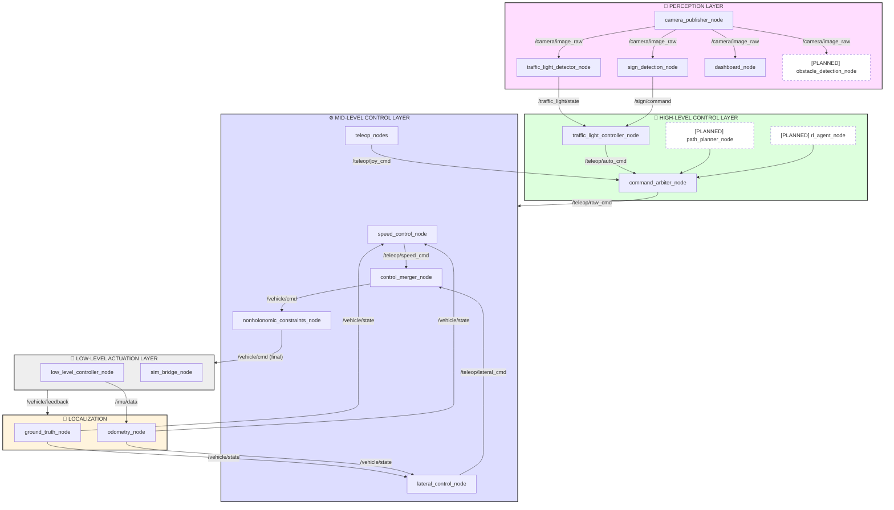
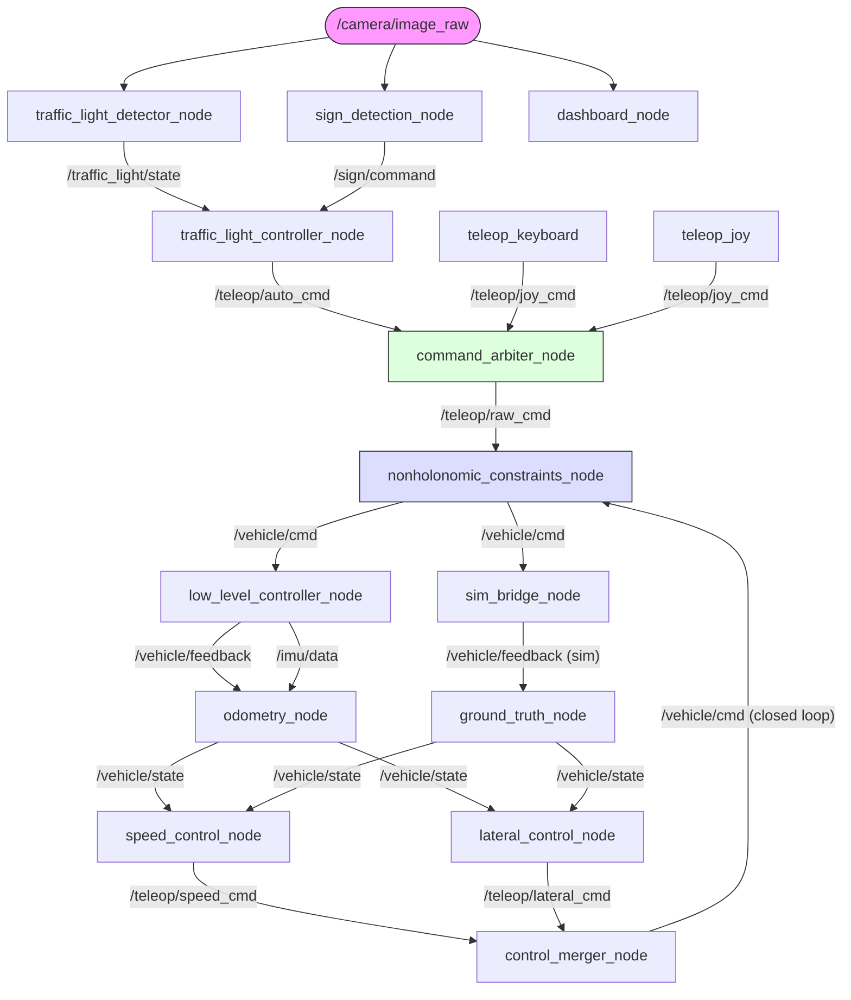
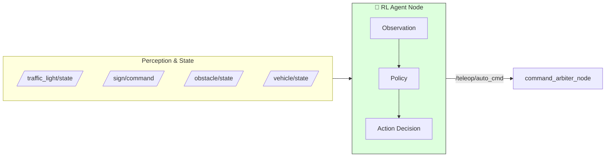

# Zooba — Autonomous 1:10 Scale Vehicle

<p align="center">
  <em>A modular ROS 2 autonomous driving stack for a 1:10 scale car — from perception to actuation.</em>
</p>

---

## Table of Contents

- [Project Vision](#project-vision)
- [Current Features](#current-features)
- [System Architecture](#system-architecture)
- [Package Breakdown](#package-breakdown)
  - [Perception](#1-perception)
  - [High-Level Controller](#2-high-level-controller)
  - [Mid-Level Controller](#3-mid-level-controller)
  - [Low-Level Controller](#4-low-level-controller)
  - [Localization](#5-localization)
  - [Simulation](#6-simulation--digital-twin)
  - [Vehicle Interfaces](#7-vehicle-interfaces)
  - [Firmware](#8-firmware)
- [Topic & Data Flow](#topic--data-flow)
- [Hardware Setup](#hardware-setup)
- [Software Setup](#software-setup)
- [How to Run](#how-to-run)
  - [Simulation (Digital Twin)](#simulation-digital-twin)
  - [Physical Hardware](#physical-hardware)
  - [Teleoperation Controls](#teleoperation-controls)
- [Configuration & Tuning](#configuration--tuning)
- [Roadmap](#roadmap)

---

## Project Vision

The ultimate goal of Zooba is to build a **fully autonomous 1:10 scale vehicle** that behaves as an intelligent agent — capable of perceiving its environment, planning optimal paths, and making real-time decisions such as:

- 🚦 **Obeying traffic signals** — stopping at red lights, slowing at yellow
- 🛑 **Responding to traffic signs** — stop signs, slow down, directional signs
- 🚗 **Dynamic lane changes** — changing lanes when a vehicle is detected in front
- 🗺️ **Path planning** — computing and following optimal trajectories through waypoints
- 🧠 **Learned behaviour (RL)** — a reinforcement learning agent that makes high-level driving decisions based on the fused perception state

The project is modular by design: each subsystem (perception, planning, control, actuation) is a separate ROS 2 package that communicates through well-defined interfaces, making it easy to swap, upgrade, or extend any layer independently.

---

## Current Features

| Layer | Feature | Status |
|:------|:--------|:------:|
| **Perception** | Traffic light detection (RED / YELLOW / GREEN) via HoughCircles + HSV classification | ✅ |
| **Perception** | Traffic sign detection (STOP, SLOW_DOWN, TURN_LEFT, TURN_RIGHT) via contour + colour analysis | ✅ |
| **Perception** | Shared camera publisher node (single hardware owner) | ✅ |
| **Perception** | Unified HUD dashboard with telemetry overlay | ✅ |
| **High-Level** | Traffic light controller — perception-reactive velocity & heading commands | ✅ |
| **High-Level** | Command arbiter — merges joystick (manual) and autonomous commands with safety overrides | ✅ |
| **Mid-Level** | Extended Stanley lateral controller (cross-track + heading + derivative damping) | ✅ |
| **Mid-Level** | PI speed controller with anti-windup and bypass mode | ✅ |
| **Mid-Level** | Control merger node (speed + lateral → unified VehicleCmd) | ✅ |
| **Mid-Level** | Non-holonomic constraints enforcement (Ackermann geometry, rate-limiting) | ✅ |
| **Mid-Level** | Teleoperation — keyboard (`W/A/S/D`) and Bluetooth joystick (PS4/PS5) | ✅ |
| **Low-Level** | Serial bridge (Raspberry Pi ↔ Arduino) with bidirectional command/feedback | ✅ |
| **Localization** | Ground truth node (Gazebo world-frame pose for simulation) | ✅ |
| **Localization** | Dead-reckoning odometry node (IMU heading + encoder integration) | ✅ |
| **Simulation** | 1:1 Gazebo Harmonic digital twin with Ackermann steering model | ✅ |
| **Simulation** | Sim bridge node — command relay + simulated encoder feedback | ✅ |
| **Simulation** | RViz vehicle visualisation node | ✅ |
| **Simulation** | Closed-loop simulation launch (Gazebo + localization + controllers) | ✅ |
| **Firmware** | Arduino firmware — motor (L298N), servo (MG995), encoder, IMU (MPU6050) | ✅ |
| **High-Level** | Path planner (waypoint / A* / RRT*) | 🔜 Planned |
| **High-Level** | RL decision-making agent | 🔜 Planned |
| **Perception** | Obstacle / vehicle detection (front car awareness) | 🔜 Planned |
| **Localization** | Sensor fusion (EKF: IMU + encoder + camera) | 🔜 Planned |

---

## System Architecture

The architecture follows a **four-tier layered design**: Perception → High-Level Control → Mid-Level Control → Low-Level Actuation, with a parallel Localization module providing state estimation to all control layers.



---

## Package Breakdown

### 1. Perception

**Package:** `perception`

The perception layer processes camera imagery to detect and classify traffic signals and signs in real-time.

| Node | Description |
|:-----|:------------|
| `camera_publisher_node` | Single owner of the physical camera (V4L2). Publishes frames to `/camera/image_raw` so all perception nodes share one stream. Supports resolution, FPS, and flip configuration. |
| `traffic_light_detector_node` | Detects traffic light states (RED / YELLOW / GREEN) using a classical CV pipeline: ROI cropping → CLAHE preprocessing → HoughCircles → proximity clustering → HSV colour classification → temporal voting. Supports **DETECTION** and **TRACKING** modes for performance. |
| `sign_detection_node` | Detects traffic signs (STOP, SLOW_DOWN, TURN_LEFT, TURN_RIGHT) via contour analysis with HSV colour masking (red hexagons, yellow diamonds, blue circles with arrow direction sensing). Uses temporal voting for stability. |
| `dashboard_node` | Unified HUD overlay on the live camera feed displaying: traffic light state, sign detection, velocity gauges, steering needle, encoder RPM, and safety override flash alerts. |

**Topics Published:**
- `/camera/image_raw` — raw camera frames
- `/traffic_light/state` — `RED`, `YELLOW`, `GREEN`, or `UNKNOWN`
- `/sign/command` — `STOP`, `SLOW_DOWN`, `TURN_LEFT`, `TURN_RIGHT`, or `NO_SIGNAL`

---

### 2. High-Level Controller

**Package:** `high_level_controller`

The decision-making layer that translates perception outputs into autonomous driving commands.

| Node | Description |
|:-----|:------------|
| `traffic_light_controller_node` | Subscribes to `/traffic_light/state` and `/sign/command`. Uses a "most-restrictive-wins" policy: RED/STOP → velocity 0, YELLOW/SLOW_DOWN → slow velocity, GREEN → cruise velocity. Heading decisions react to TURN_LEFT/TURN_RIGHT signs. Includes smooth velocity ramping and perception timeout handling. |
| `command_arbiter_node` | Merges manual joystick commands (`/teleop/joy_cmd`) with autonomous commands (`/teleop/auto_cmd`). Joystick takes priority when active, but **perception safety overrides always apply** regardless of source — RED lights and STOP signs force the vehicle to halt even during manual driving. |

**Topics Published:**
- `/teleop/auto_cmd` — autonomous velocity + heading from traffic controller
- `/teleop/raw_cmd` — final merged command to mid-level

---

### 3. Mid-Level Controller

**Package:** `mid_level_controller`

Closed-loop motion controllers and teleoperation nodes.

| Node | Description |
|:-----|:------------|
| `lateral_control_node` | **Extended Stanley Controller** for lateral (steering) control. Computes cross-track error as point-to-line perpendicular distance, heading error with proportional gain `k_heading`, derivative damping `k_d_heading`, and Stanley cross-track term. Supports arbitrary path headings and dynamic parameter tuning at runtime. |
| `speed_control_node` | **PI speed controller** with anti-windup. Closed-loop velocity regulation with configurable `kp`, `ki`, output saturation, and a `bypass_pi` mode for open-loop operation. |
| `control_merger_node` | Merges the separate speed (`Float64`) and lateral (`Float64`) control outputs into a single `VehicleCmd` message. |
| `nonholonomic_constraints_node` | Enforces physical limits: maximum velocity, maximum steering angle, acceleration/deceleration rate-limiting, and Ackermann geometry constraints. |
| `teleop_keyboard_node` | Keyboard teleoperation (W/A/S/D + Space for emergency stop). |
| `teleop_joy_node` | Joystick teleoperation (PS4/PS5 Bluetooth) with configurable axis mapping. |
| `odometry_node` | Encoder-based odometry (wheel tick integration for position estimation). |
| `open_loop_node` | Open-loop command passthrough for testing. |

**Topics Published:**
- `/teleop/speed_cmd` — velocity command from PI controller
- `/teleop/lateral_cmd` — steering command from Stanley controller
- `/vehicle/cmd` — merged VehicleCmd (velocity + heading)

---

### 4. Low-Level Controller

**Package:** `low_level_controller`

The hardware interface layer that bridges ROS 2 ↔ physical actuators.

| Node | Description |
|:-----|:------------|
| `low_level_controller_node` | Bidirectional serial bridge between the Raspberry Pi 4B and Arduino Uno. Sends velocity + steering commands as serial packets, receives encoder ticks + IMU data as feedback. Publishes `VehicleFeedback` (velocity, RPM, encoder ticks) and `ImuData` (accelerometer, gyroscope, fused yaw). |

**Topics Published:**
- `/vehicle/feedback` — encoder + velocity feedback from hardware
- `/imu/data` — IMU sensor data from MPU6050

---

### 5. Localization

**Package:** `localization`

State estimation providing the vehicle's pose (x, y, yaw) and velocity to all controllers.

| Node | Description | Used In |
|:-----|:------------|:--------|
| `ground_truth_node` | Subscribes to Gazebo's `PosePublisher` plugin for perfect world-frame pose. Extracts wheel velocities from `/joint_states` and computes yaw rate from steering kinematics. **No drift or noise** — used only for simulation. | Simulation |
| `odometry_node` | Dead-reckoning from encoder ticks (distance) and IMU yaw (heading). Position is integrated as `x += Δd·cos(yaw)`, `y += Δd·sin(yaw)`. This mirrors what the real car does — no global frame access. | Hardware |

**Topics Published:**
- `/vehicle/state` — unified `VehicleState` (x, y, yaw, velocity, yaw_rate, steering_angle)

---

### 6. Simulation / Digital Twin

**Package:** `zooba_simulation` + `gazebo_ackermann_steering_vehicle` (submodule)

A full 1:1 digital twin in Gazebo Harmonic with Ackermann steering physics.

| Node / Component | Description |
|:------------------|:------------|
| `sim_bridge_node` | Translates `/vehicle/cmd` (VehicleCmd) into Gazebo-compatible `/steering_angle` and `/velocity` topics. Also generates simulated `/vehicle/feedback` (encoder-like data from wheel joint velocities). |
| `rviz_vehicle_node` | Publishes TF transforms and markers for RViz visualisation of the vehicle. |
| Gazebo Ackermann Plugin | Simulates realistic Ackermann steering geometry, wheel dynamics, gravity, and friction. |

**Launch Files:**

| Launch File | Description |
|:------------|:------------|
| `closed_loop_sim.launch.py` | Full closed-loop: Gazebo + ground truth localization + PI speed + Stanley lateral + merger. Configurable initial pose, speed, gains. |
| `full_sim.launch.py` | Gazebo + teleoperation (keyboard/joystick) for manual driving in simulation. |
| `digital_twin.launch.py` | RViz-only visualisation of vehicle state. |
| `simulation.launch.py` | Base Gazebo world + vehicle model + ROS bridges. |

---

### 7. Vehicle Interfaces

**Package:** `vehicle_interfaces`

Custom ROS 2 message definitions shared across all packages.

| Message | Fields | Purpose |
|:--------|:-------|:--------|
| `VehicleCmd` | `header`, `velocity` (m/s), `heading` (degrees) | Command from controllers to actuators |
| `VehicleState` | `header`, `x`, `y`, `yaw`, `velocity`, `yaw_rate`, `steering_angle` | Unified vehicle state from localization |
| `VehicleFeedback` | `actual_velocity`, `actual_rpm`, `encoder_ticks` | Hardware feedback from Arduino |
| `ImuData` | `header`, `accel_x/y/z`, `gyro_x/y/z`, `yaw` | IMU sensor data (MPU6050) |
| `VehicleConstraints` | `max_velocity`, `max_steering_angle_deg`, `min_turning_radius`, `wheelbase`, `constraints_active` | Constraint diagnostics |

---

### 8. Firmware

**Location:** `firmware/low_level_controller/low_level_controller.ino`

Arduino Uno firmware handling:
- **Motor control** — JGA-370 DC motor via L298N H-Bridge (PWM speed + direction)
- **Steering** — MG995 servo (angle mapping from degrees to pulse width)
- **Encoder** — interrupt-driven tick counting + RPM computation
- **IMU** — MPU6050 (HW-123) reading with complementary filter for yaw fusion
- **Serial protocol** — bidirectional packet communication with the ROS 2 node

---

## Topic & Data Flow



---

## Hardware Setup

### Components

| Component | Model | Role |
|:----------|:------|:-----|
| **Compute** | Raspberry Pi 4B | Main ROS 2 brain |
| **Microcontroller** | Arduino Uno | Low-level actuator control |
| **Camera** | USB Webcam (V4L2) | Visual perception |
| **IMU** | HW-123 (MPU6050) | Heading estimation |
| **Drive Motor** | 12V JGA-370 DC Motor (with encoder) | Propulsion |
| **Motor Driver** | L298N H-Bridge | Motor power switching |
| **Steering** | MG995 Servo Motor | Front wheel steering |
| **Power** | 12V 5A DC Power Supply | System power |
| **Voltage Regulator** | LM2596 Buck Converter | 12V → 6V for servo |

### Wiring Notes

- The 12V supply powers the L298N motor driver.
- **⚠️ CRITICAL:** The MG995 servo runs strictly on **6V**. Use a Buck Converter (e.g., LM2596) to step 12V → 6V. Running the servo on 12V will damage the Arduino via backward voltage leaks.
- L298N `ENA`, `IN1`, `IN2` logic pins connect to Arduino PWM digital pins.
- A **common ground** is shared between the Arduino, L298N, servo, Buck Converter, and power supply.
- Pi ↔ Arduino communication: USB Serial.

---

## Software Setup

### Prerequisites

- **OS:** Ubuntu 24.04
- **ROS 2:** Jazzy Jalisco
- **Simulator:** Gazebo Harmonic
- **Python:** 3.12 (with OpenCV, NumPy, PySerial, PyYAML)

### Install ROS 2 Dependencies

```bash
sudo apt update
sudo apt install -y \
  ros-jazzy-ros2-controllers \
  ros-jazzy-gz-ros2-control \
  ros-jazzy-ros-gz \
  ros-jazzy-ros-gz-bridge \
  ros-jazzy-joint-state-publisher \
  ros-jazzy-robot-state-publisher \
  ros-jazzy-xacro \
  ros-jazzy-joy
```

### Build the Workspace

```bash
cd ~/zooba_workspace
source /opt/ros/jazzy/setup.bash

# Checkout external submodules
git submodule update --init --recursive

# Build and source
colcon build
source install/setup.bash
```

---

## How to Run

### Simulation (Digital Twin)

#### Manual Teleoperation in Simulation

**Keyboard Control:**
```bash
ros2 launch zooba_simulation full_sim.launch.py
```
*(Focus the spawned `xterm` window to capture `W`, `A`, `S`, `D`, `Space` commands)*

**Joystick Control (PS4/PS5):**
```bash
ros2 launch zooba_simulation full_sim.launch.py teleop_type:=joy
```

#### Closed-Loop Autonomous Simulation

Run the full autonomous closed-loop (Gazebo + localization + PI speed + Stanley lateral):

```bash
# Default settings (0.3 m/s, lane y=1.0)
ros2 launch zooba_simulation closed_loop_sim.launch.py

# Custom initial pose and goals
ros2 launch zooba_simulation closed_loop_sim.launch.py \
    x:=1.0 y:=0.5 Y:=0.0 \
    desired_speed:=0.8 desired_y:=2.0

# Tune controller gains
ros2 launch zooba_simulation closed_loop_sim.launch.py \
    kp:=2.0 ki:=0.3 k_stanley:=3.0 k_d_heading:=1.0
```

---

### Physical Hardware

#### Perception + Autonomous Driving (Full Stack)

**Terminal 1 — High-Level Controller (perception + decision-making + arbiter):**
```bash
ros2 launch high_level_controller high_level_controller.launch.py
```

**Terminal 2 — Mid-Level Controller (constraints + teleop):**
```bash
# Keyboard
ros2 launch mid_level_controller mid_level_controller.launch.py

# Joystick
ros2 launch mid_level_controller mid_level_controller.launch.py teleop_type:=joy
```

**Terminal 3 — Low-Level Controller (serial bridge to Arduino):**
```bash
ros2 launch low_level_controller low_level_controller.launch.py
```

#### Closed-Loop Hardware (with Localization)

```bash
ros2 launch high_level_controller closed_loop_hw.launch.py
```

---

### Teleoperation Controls

**Keyboard:**
| Key | Action |
|:---:|:-------|
| `W` | Accelerate forward |
| `S` | Accelerate backward |
| `A` | Steer left |
| `D` | Steer right |
| `Space` | Emergency stop |
| `Q` | Quit |

**Joystick (PS4/PS5):**
| Input | Action |
|:------|:-------|
| `R2 / RT` | Accelerate |
| `L2 / LT` | Brake / Reverse |
| `Left Stick (H)` | Steering |
| `X / A` | Emergency stop |
| `Circle / B` | Release emergency stop |

---

## Configuration & Tuning

### Vehicle Constraints

Edit `/src/mid_level_controller/config/vehicle_constraints.yaml`:
- **`max_velocity`** — top forward/reverse speed limits
- **`max_velocity_rate`** — acceleration responsiveness
- **`max_steering_rate`** — how fast the servo sweeps

### Traffic Light Detector

Edit `/src/perception/config/traffic_light_detector.yaml`:
- HSV colour thresholds (`red_lower1/upper1`, `green_lower/upper`, etc.)
- HoughCircles parameters (`dp`, `param1`, `param2`, `min_radius`, `max_radius`)
- Clustering parameters and temporal filtering

A **local override** file (`traffic_light_detector.local.yaml`) can be placed in the same directory — it is gitignored and does not require a rebuild.

### High-Level Controller

Edit `/src/high_level_controller/config/high_level_controller.yaml`:
- `cruise_velocity` — speed on GREEN light
- `slow_velocity` — speed on YELLOW/SLOW_DOWN/turns
- `turn_heading` — steering angle for directional signs
- `unknown_timeout` — perception failure timeout

### Stanley & PI Gains (Simulation)

All gains can be tuned at launch time:
```bash
ros2 launch zooba_simulation closed_loop_sim.launch.py \
    kp:=1.5 ki:=0.2 \
    k_heading:=1.5 k_stanley:=2.0 k_d_heading:=0.5
```

Or dynamically at runtime:
```bash
ros2 param set /lateral_control_node desired_y 2.0
ros2 param set /speed_control_node desired_speed 0.8
```

---

## Roadmap

### Near-Term: Path Planning Integration

The current system follows a fixed lateral setpoint (`desired_y`) and heading. The next step is to integrate a **path planning module** into the high-level control layer:

- **Waypoint following** — a sequence of (x, y) waypoints that the lateral controller tracks
- **Global planner** — A* or RRT* over an occupancy grid for optimal route computation
- **Local planner** — reactive trajectory adjustment around dynamic obstacles
- **Path → Controller interface** — the planner publishes desired (x, y, heading) waypoints; the Stanley controller tracks them in real-time

### Mid-Term: Obstacle Awareness & Lane Change

- **Obstacle detection node** — camera-based vehicle/obstacle detection (YOLO or contour-based)
- **Front vehicle tracking** — detect if a car is directly ahead and estimate distance
- **Lane change decision** — when a slow/stopped vehicle is detected in the current lane, trigger a lane change manoeuvre by updating the lateral controller's `desired_y` and `desired_heading`

### Long-Term: Reinforcement Learning Agent

The ultimate vision is to replace the rule-based high-level controller with a **trained RL agent** that learns to drive from experience:

- **State space** — fused perception state (traffic light, signs, obstacles, distance to front car, current lane, velocity, position)
- **Action space** — high-level decisions: maintain lane, change lane left/right, accelerate, decelerate, stop
- **Reward function** — reward for: reaching destination, obeying traffic rules, smooth driving; penalty for: collisions, traffic violations, harsh braking
- **Training environment** — the Gazebo digital twin serves as the RL training simulator
- **Deployment** — the trained policy runs as a ROS 2 node (`rl_agent_node`) that publishes decisions to the command arbiter, seamlessly integrating with the existing control stack



The modular architecture ensures the RL agent slots in at the high-level layer without changes to mid-level controllers, localization, or hardware — it simply replaces the rule-based traffic controller as the source of `/teleop/auto_cmd`.

---

<p align="center">
  <strong>Zooba</strong> — from teleoperation to full autonomy, one layer at a time. 🚗
</p>
